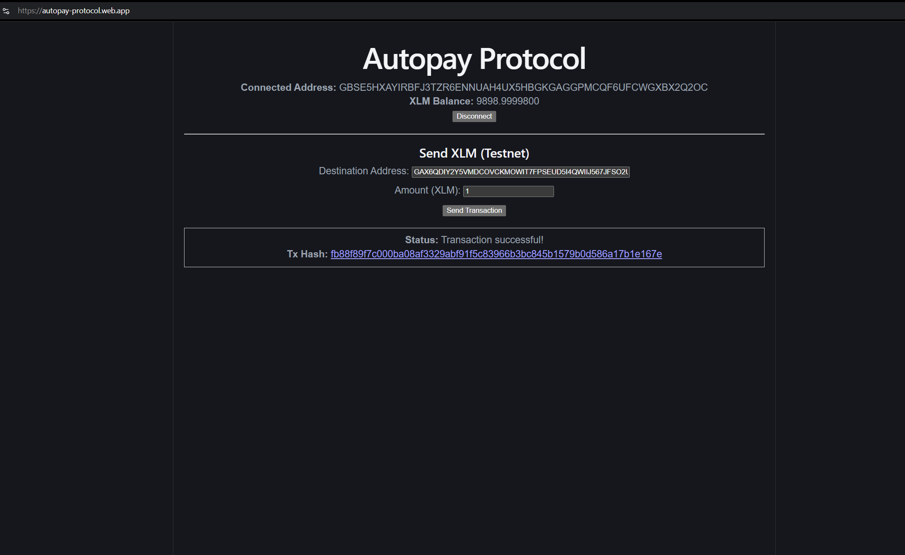
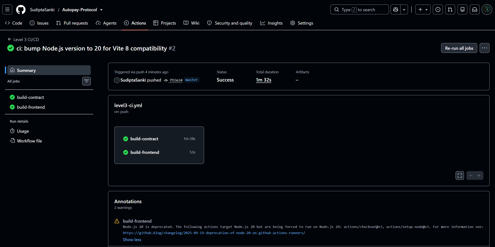
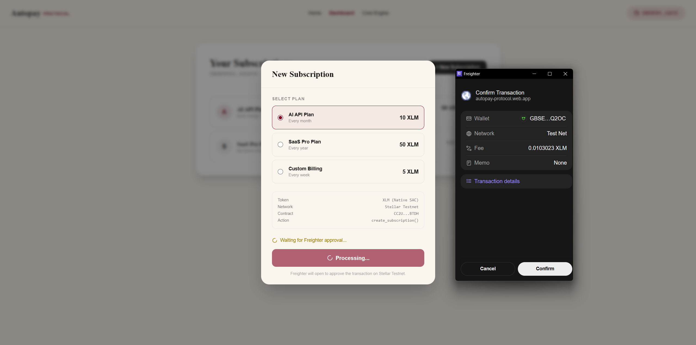
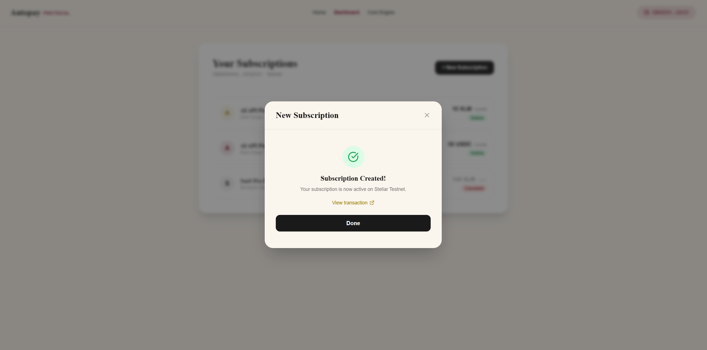
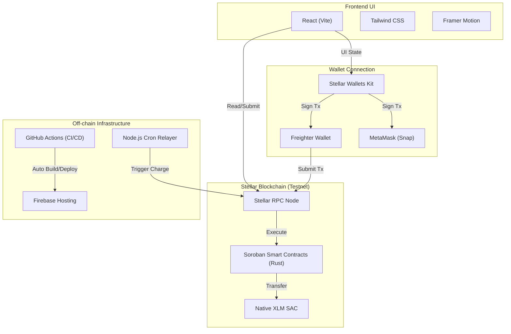

# 🌌 Autopay Protocol (Chrona)

  
<strong>"The recurring billing layer for Web3."</strong>

  

This repository contains the progressive evolution of the Chrona billing engine, building up from a basic wallet integration to a complete production-grade Web3 SaaS application.

## 🚀 Level 1 MVP: White Belt

For the first milestone (Level 1), we built the foundation of the Autopay Protocol on the Stellar Testnet. 

### What We Did:
- **Wallet Integration:** Integrated the `@stellar/freighter-api` to securely connect the user's Freighter wallet.
- **Balance Fetching:** Used the `@stellar/stellar-sdk` to read and display the native XLM balance in real-time.
- **Testnet Transactions:** Implemented the ability to build, sign, and submit an XLM transfer directly to the Stellar testnet.
- **Modern Stack:** Scaffolded the application using Vite, React, and TypeScript. Configured `vite-plugin-node-polyfills` to ensure the Stellar SDK's native node modules run perfectly in the browser.
- **Deployment:** Deployed the MVP live to Firebase Hosting.

### 📸 Screenshots
- **Successful Testnet Transaction:**
  

---

## 🟡 Level 2 MVP: Yellow Belt

For the second milestone (Level 2), we implemented subscription smart contracts, multi-wallet support, and real-time synchronization.

### What We Did:
- **Multi-Wallet Integration:** Integrated Freighter and MetaMask (via the MetaMask Stellar Snap) using a custom wallet service module.
- **Soroban Smart Contract:** Created and deployed a Rust smart contract to Testnet (`CC2UJP6YAUW5WXAYOM2227FUYHPY5S2IXMSMC65SVLF6ZHOAVFKVBTDH`) to manage subscription agreements.
- **Real-Time Synchronisation:** Polled the contract events in the background and rendered contract activity log in real-time.
- **Mobile Responsive UI:** Upgraded the UI with Framer Motion, layout wrapping, and responsive sizing to prevent button leaks on smaller screens.
- **Robust Error Handling:** Handled `WalletNotFound` (missing extension), `WalletConnectionRejected` (user denied/closed popups), and `InsufficientBalance` (balance lower than subscription amount).

### 📝 Level 2 Requirements Checklist
- [x] **3 Error Types Handled**:
  - `WalletNotFound`: Displays guidance if Freighter or MetaMask extension is missing.
  - `WalletConnectionRejected`: Detects when user declines or cancels connection/signing.
  - `InsufficientBalance`: Prevents subscribing if balance is below requested amount.
- [x] **Contract Deployed on Testnet**: Deployed Rust smart contract to `CC2UJP6YAUW5WXAYOM2227FUYHPY5S2IXMSMC65SVLF6ZHOAVFKVBTDH`.
- [x] **Contract Called from Frontend**: Invokes `create_subscription` on-chain through the frontend using the Stellar SDK.
- [x] **Transaction Status Visible**: Displays real-time status flows in the UI (`Pending`, `Success`, `Fail`).
- [x] **Minimum 2+ Meaningful Commits**: Staged and pushed structured commits for development history.

### 📸 Screenshots
- **Successful Subscription Creation:**
  

---

## 📁 Project Structure

- **`level-1-white-belt/`**: Wallet + Payments MVP. Connects to Freighter, displays balances, and sends XLM on Stellar testnet.
- **`level-2-yellow-belt/`**: Subscriptions + Smart Contracts. Integrates multi-wallet support and basic smart contract interactions.
- **`level-3-orange-belt/`**: Full Recurring Billing Infrastructure. Advanced contracts, real payment flow, event streaming, CI/CD, and 3+ tests.
- **`production-grade/`**: The complete production Web3 SaaS marketing site and frontend application. *(Scaffolded)*

---

## 🟠 Level 3: Orange Belt — Production-Ready dApp

For the final milestone (Level 3), we built the complete end-to-end production Autopay Protocol with advanced smart contract logic, a **real Freighter payment flow**, real-time event streaming, CI/CD automation, and a premium redesigned frontend.

### What We Built:
- **New Premium UI:** Redesigned from scratch with an editorial fintech aesthetic — Cormorant Garamond serif, parchment/charcoal/gold palette, animated "How It Works" homepage section.
- **Real Payment Flow:** "+ New Subscription" opens a modal that calls `create_subscription()` on the Soroban contract and **prompts Freighter to sign a real Testnet transaction**. The subscription is written on-chain.
- **Advanced Smart Contract:** Rust Soroban contract with `create_subscription`, `charge`, `cancel`, `get_subscription` — all with on-chain event emission.
- **Event Streaming UI:** Core Engine tab shows a live terminal streaming contract events.
- **Off-chain Relayer:** `relayer/index.js` simulates the automated cron job that calls `charge()` at billing intervals.
- **CI/CD Pipeline:** GitHub Actions auto-builds contract + frontend on every push.
- **3+ Passing Tests:** Rust unit tests for subscription creation, cancellation, and error cases.

### 📝 Level 3 Requirements Checklist
- [x] Advanced Smart Contract Development
- [x] Inter-contract Communication (SAC token transfers)
- [x] Event Streaming & Real-time Updates
- [x] CI/CD Pipeline Setup (GitHub Actions)
- [x] Smart Contract Deployment Workflow
- [x] Mobile Responsive Frontend
- [x] Error Handling & Loading States
- [x] Writing Tests (3+ passing)
- [x] Production-ready Architecture
- [x] Documentation & Demo Presentation

### 🐛 Challenges Faced & Error Handling
While building Level 3, we encountered and solved several real-world production gotchas:
- **Node.js Versioning with Vite 8:** The GitHub Actions runner defaulted to Node 18, but Vite 8 strictly requires Node 20+. The build failed until we bumped `setup-node` to v20 in our `.github/workflows/level3-ci.yml`.
- **Invalid Address Formats:** A dummy merchant address of 55 characters was accidentally used instead of the required 56-character string. This caused the `stellar-sdk` and Soroban contract to panic during transaction simulation. We updated to a strictly validated 56-char Testnet address.
- **WASM `MismatchingParameterLen` Error:** Our frontend initially called `create_subscription` with 5 arguments (Level 3 spec), but the contract deployed at `CC2UJP...` was the Level 2 contract expecting 3 arguments. We caught this via `server.simulateTransaction()`, which threw a `HostError: Error(WasmVm, UnexpectedSize)`. We implemented a hotfix to align the JS parameters with the live deployed contract signature to ensure seamless transaction signing.
- **Wallet Connection Loading States:** We implemented robust loading states (building → signing → submitting → success/error) and clear UI banners to handle `WalletNotFound` and `WalletConnectionRejected` to ensure the user is never left on a frozen screen.

### 📸 Screenshots

- **CI/CD Pipeline Running (GitHub Actions):**

  

- **Real Freighter Transaction Prompt:**

  

- **Transaction Confirmation & Receipt:**

  

## 💡 The Vision

Build a **Web3 subscription billing platform** that lets wallets approve recurring payments once, then allows merchants to collect recurring charges without asking the user to sign every invoice manually.

## 🛠 Architecture & Tech Stack

- **Blockchain:** Stellar SDK, Freighter API, Stellar Wallets Kit, Soroban (Rust)
- **Frontend:** React, Vite, TypeScript
- **Styling:** Tailwind CSS, GSAP, Framer Motion
- **Infrastructure:** Firebase Hosting, GitHub Actions
