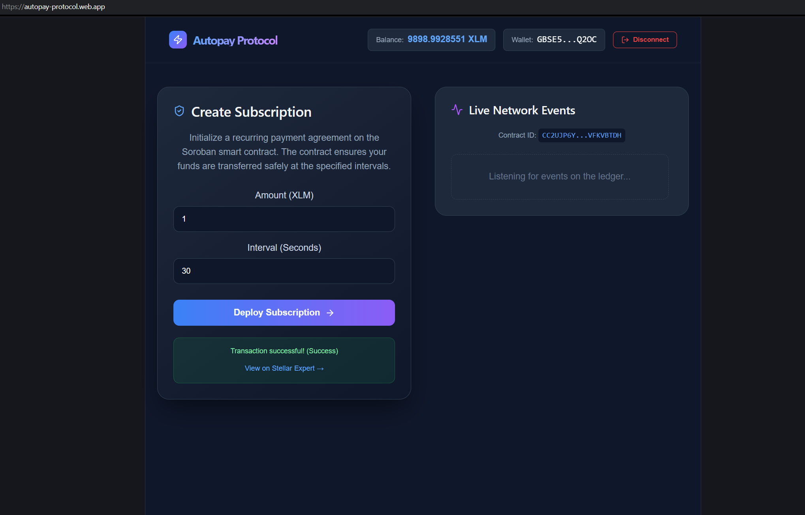

# 🌌 Autopay Protocol - Level 2 (Yellow Belt)

This directory contains the **Level 2** implementation of the Autopay Protocol. 

## 🚀 What We Built
- **Multi-Wallet Integration:** Supported Freighter and MetaMask (using MetaMask Stellar Snap `npm:stellar-snap` for non-custodial key derivation).
- **Soroban Smart Contract:** Wrote, compiled, and deployed a Rust-based Soroban subscription smart contract managing recurring agreements.
- **Frontend Contract Invocation:** Connected the React frontend to the contract using the Stellar SDK and Soroban RPC.
- **Real-Time Event Handling:** Implemented live polling for `SubscriptionCreated` events emitted by the smart contract.
- **Mobile Responsive UI:** Created custom responsive styles to prevent button leaking on smaller viewports.
- **Robust Error Handling:** Handled:
  - `WalletNotFound`: Displays warning if the extension is missing.
  - `WalletConnectionRejected`: Detects if user declines or cancels connection/signature.
  - `InsufficientBalance`: Disallows subscribing if the user's XLM balance is below the requested subscription amount.

### 📸 Screenshot

## 🔗 Live Data
- **Contract Address:** `CC2UJP6YAUW5WXAYOM2227FUYHPY5S2IXMSMC65SVLF6ZHOAVFKVBTDH`
- **Network:** Stellar Testnet

## 📝 Level 2 Requirements Checklist
- [x] **3 Error Types Handled**:
  - `WalletNotFound`: Displays guidance if Freighter or MetaMask extension is missing.
  - `WalletConnectionRejected`: Detects when user declines or cancels connection/signing.
  - `InsufficientBalance`: Prevents subscribing if balance is below requested amount.
- [x] **Contract Deployed on Testnet**: Deployed Rust smart contract to `CC2UJP6YAUW5WXAYOM2227FUYHPY5S2IXMSMC65SVLF6ZHOAVFKVBTDH`.
- [x] **Contract Called from Frontend**: Invokes `create_subscription` on-chain through the frontend using the Stellar SDK.
- [x] **Transaction Status Visible**: Displays real-time status flows in the UI (`Pending`, `Success`, `Fail`).
- [x] **Minimum 2+ Meaningful Commits**: Staged and pushed structured commits for development history.

## 🛠 Setup Instructions
1. Navigate to this directory: `cd level-2-yellow-belt`
2. Install dependencies: `npm install`
3. Run the development server: `npm run dev`
4. Make sure your wallet is set to **Testnet** and funded.

*(To compile the contract yourself, ensure you have Rust and the `wasm32v1-none` target installed, then use the `stellar-cli` to build and deploy from the `contracts/subscription` folder).*
