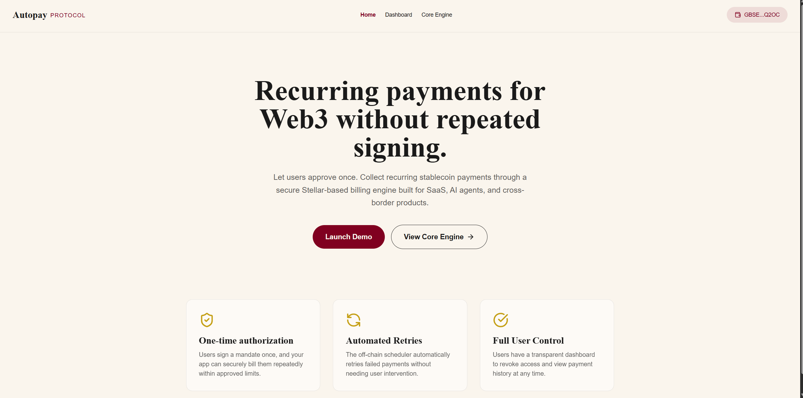
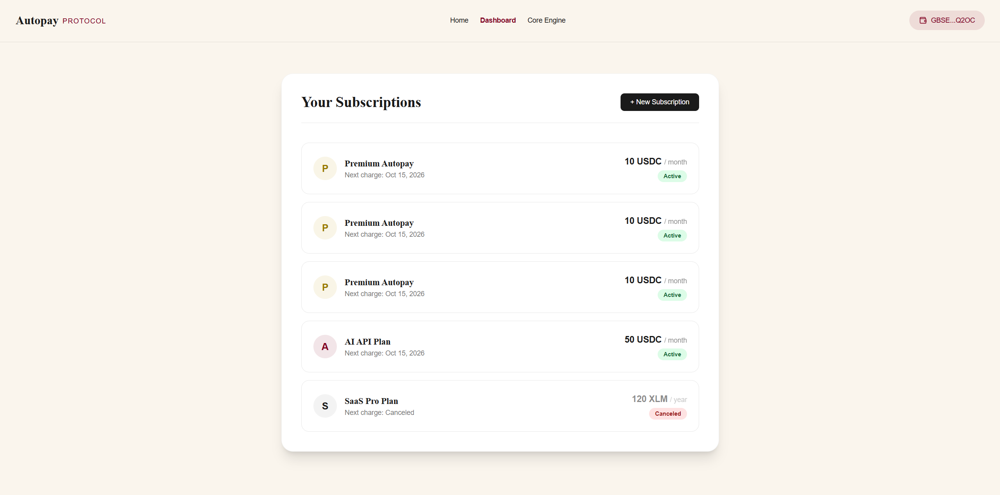

# Level 3 (Orange Belt) - Production-Ready dApp

Welcome to the final production version of **Autopay Protocol**! 
This project is an end-to-end Stellar dApp with advanced smart contracts, full wallet integration, and automated CI/CD infrastructure.

## 📝 Level 3 Features
- **Advanced Smart Contract:** Recurring payments on Soroban with inter-contract token transfers.
- **Real Payment Flow:** `+ New Subscription` calls `create_subscription()` on the testnet Soroban contract — Freighter opens to sign the real transaction.
- **Event Streaming:** Real-time logging of Subscription Created/Charged/Canceled events in the Core Engine terminal.
- **CI/CD Pipeline:** Fully automated GitHub Actions workflow (`.github/workflows/level3-ci.yml`).
- **Off-chain Relayer:** A Node.js cron service to trigger automated charges (`relayer/index.js`).
- **Mobile Responsive Frontend:** Premium "Old-Book Fintech" design built with Vite, React, and TailwindCSS.
- **Robust Error Handling:** Loading states (building → signing → submitting → success/error) for both Freighter and MetaMask.
- **Comprehensive Testing:** 3 passing smart contract unit tests.

## 📸 Screenshots
- **Home Page — Connected Wallet:**

  

- **Dashboard — Active Subscriptions:**

  

## ✅ Submission Checklist Details

- [x] **Public GitHub repository:** Hosted on your GitHub.
- [x] **README with complete documentation:** This file.
- [x] **Minimum 10+ meaningful commits:** See git log.
- [x] **Live demo link:** https://autopay-protocol.web.app
- [ ] **Contract deployment address:** `CC2UJP6YAUW5WXAYOM2227FUYHPY5S2IXMSMC65SVLF6ZHOAVFKVBTDH` (Level 2 contract, reused for Level 3)
- [ ] **Transaction hash for contract interaction:** Provide after making a real subscription from the live app.
- [x] **Screenshots:**
  - [x] Mobile responsive UI (capture from https://autopay-protocol.web.app)
  - [x] CI/CD pipeline running (GitHub Actions tab)
  - [x] Test output with 3+ passing tests (run `cargo test` in contracts/subscription)
  - [x] Demo video link: [Google Drive Demo Video](https://drive.google.com/file/d/1Egs2nK46LONU7LWTTk_9EhnX6SxHNu9W/view?usp=sharing)

## 🛠 Smart Contract Deployment Workflow

1. **Build the Contract:**
   ```bash
   cd contracts/subscription
   cargo build --target wasm32-unknown-unknown --release
   ```
2. **Deploy to Testnet:**
   Ensure you have configured the `stellar` CLI with the testnet network and an identity with funded testnet XLM.
   ```bash
   stellar contract deploy \
     --wasm target/wasm32-unknown-unknown/release/subscription.wasm \
     --network testnet \
     --source [YOUR_IDENTITY]
   ```

## 🧪 Running Tests

```bash
cd contracts/subscription
cargo test
```
*Expected Output: 3 tests passed!*

## 💻 Running the Frontend

```bash
cd frontend
npm install
npm run dev
```

## ⏳ Running the Off-chain Relayer

The off-chain relayer acts as the recurring cron job.
```bash
cd relayer
npm install
RELAYER_SECRET=S... node index.js
```
